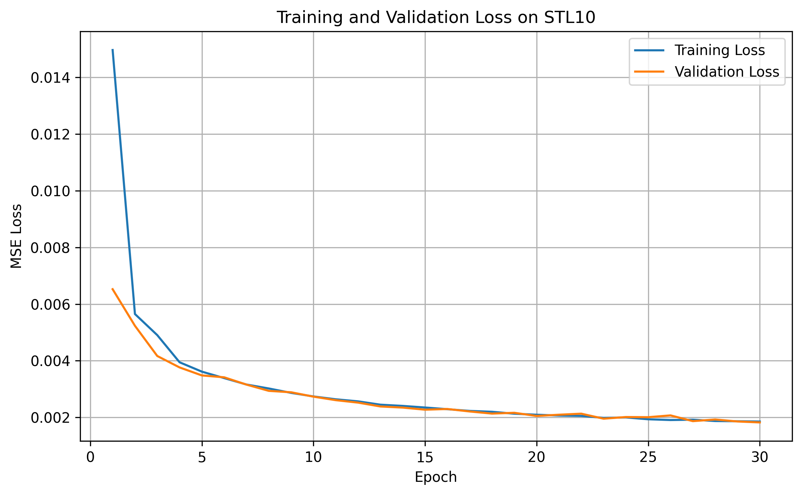
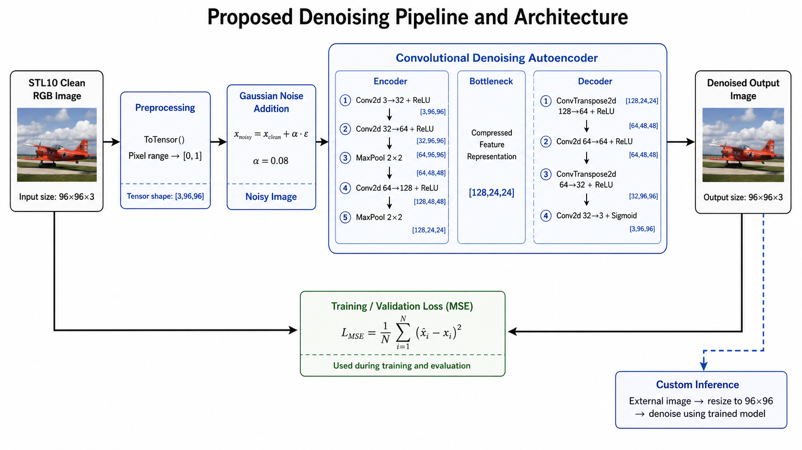

# Color Image Denoising with a Convolutional Autoencoder

This project implements a deep learning pipeline for **color image denoising** using a convolutional autoencoder trained on the STL10 dataset. The model receives a noisy RGB image as input and learns to reconstruct a cleaner version of the original image.

The project was developed as a computer vision project and is structured as a reproducible PyTorch implementation with training, validation, visualization, and custom image inference.

---

## Project Overview

Image noise is a common problem in computer vision. It can reduce visual quality and negatively affect downstream tasks such as classification, detection, and segmentation.

In this project, clean STL10 images are artificially corrupted with Gaussian noise. The autoencoder is then trained to map the noisy image back to the original clean image.

```text
Clean image → Add Gaussian noise → Noisy image → Autoencoder → Denoised image
```

The goal is not to build a state-of-the-art denoising model, but to create a clear and reproducible baseline that demonstrates the full image denoising workflow.

---

## Key Features

* RGB image denoising using a convolutional autoencoder
* STL10 dataset with 96×96 color images
* Artificial Gaussian noise generation
* Encoder-decoder architecture implemented in PyTorch
* Training and validation using Mean Squared Error loss
* Loss curve visualization
* Noisy / denoised / clean image comparison
* Custom image denoising script
* Scientific report and presentation materials

---

## Example Results

The model was trained for 30 epochs on STL10 images corrupted with Gaussian noise.

Final results from the training run:

| Metric                |    Value |
| --------------------- | -------: |
| Final training loss   | 0.001882 |
| Final validation loss | 0.001852 |

The training and validation losses decreased consistently, and the curves remained close, suggesting that the model did not strongly overfit.

### Loss Curve



### Visual Denoising Results


---

## Architecture

The model is a convolutional denoising autoencoder.

The encoder compresses the noisy image into a feature representation, while the decoder reconstructs the image back to RGB format.



### Encoder

```text
Input: [batch, 3, 96, 96]

Conv2d 3 → 32 + ReLU
Conv2d 32 → 64 + ReLU
MaxPool2d

Conv2d 64 → 128 + ReLU
MaxPool2d

Bottleneck: [batch, 128, 24, 24]
```

### Decoder

```text
ConvTranspose2d 128 → 64 + ReLU
Conv2d 64 → 64 + ReLU

ConvTranspose2d 64 → 32 + ReLU
Conv2d 32 → 3 + Sigmoid

Output: [batch, 3, 96, 96]
```

The final sigmoid activation keeps output pixel values in the range `[0, 1]`.

---

## Dataset

This project uses the **STL10 dataset**, which contains 96×96 RGB images from 10 object classes.

Although STL10 is originally a classification dataset, the class labels are not used in this project. The task is image reconstruction, not classification.

| Property        | Value                     |
| --------------- | ------------------------- |
| Dataset         | STL10                     |
| Image type      | RGB                       |
| Image size      | 96×96                     |
| Training images | 5,000                     |
| Test images     | 8,000                     |
| Labels used     | No                        |
| Noise type      | Artificial Gaussian noise |

The dataset is not included in this repository because it is automatically downloaded by Torchvision when running the scripts.

---

## Noise Generation

Gaussian noise is added directly to clean images:

```text
x_noisy = x_clean + α · ε
```

where:

* `x_clean` is the original image
* `ε` is random Gaussian noise
* `α` is the noise factor

In this project:

```text
noise_factor = 0.08
```

After adding noise, pixel values are clipped to stay inside the valid range `[0, 1]`.

---

## Training Configuration

| Parameter     | Value                            |
| ------------- | -------------------------------- |
| Framework     | PyTorch                          |
| Dataset       | STL10                            |
| Optimizer     | Adam                             |
| Learning rate | 0.001                            |
| Batch size    | 16                               |
| Epochs        | 30                               |
| Noise factor  | 0.08                             |
| Loss function | Mean Squared Error               |
| Main metric   | Training and validation MSE loss |

---

## Repository Structure

```text
.
├── model.py                 # Convolutional autoencoder architecture
├── train.py                 # Training and validation script
├── visualize.py             # Visual comparison on STL10 test images
├── denoise_custom.py        # Denoise an external custom image
├── test_model_shape.py      # Checks input/output tensor shapes
├── initialize.py            # Initial dataset and noise visualization
├── requirements.txt         # Python dependencies
├── VisualGraphs/            # Figures used in README/report
├── report/                  # Scientific report PDF
└── outputs/                 # Saved custom denoising output example
```

---

## Installation

Clone the repository:

```bash
git clone https://github.com/YOUR_USERNAME/image-denoising-autoencoder.git
cd image-denoising-autoencoder
```

Create and activate a virtual environment:

```bash
python -m venv venv
```

On Windows:

```bash
venv\Scripts\activate
```

On macOS/Linux:

```bash
source venv/bin/activate
```

Install dependencies:

```bash
pip install -r requirements.txt
```

---

## Requirements

Example `requirements.txt`:

```text
torch
torchvision
matplotlib
pillow
numpy
```

If you want to use GPU acceleration with CUDA, install the PyTorch version that matches your system from the official PyTorch installation page.

---

## How to Train the Model

Run:

```bash
python train.py
```

The script will:

1. Download the STL10 dataset if it is not already available.
2. Add Gaussian noise to clean images.
3. Train the convolutional autoencoder.
4. Validate the model after each epoch.
5. Save the trained weights.
6. Plot the training and validation loss curve.

The trained model is saved as:

```text
STL10_denoising_autoencoder.pth
```

---

## How to Visualize Results

After training, run:

```bash
python visualize.py
```

This script shows a comparison between:

```text
Noisy input | Denoised output | Clean target
```

It can also save the figure as:

```text
stl10_visual_results.png
```

---

## How to Denoise a Custom Image

Run:

```bash
python denoise_custom.py
```

Then enter the path of the image you want to denoise.

Example:

```text
C:\Users\YourName\Desktop\noisy_image.png
```

The script will:

1. Load the image.
2. Resize it to 96×96.
3. Convert it to a tensor.
4. Pass it through the trained autoencoder.
5. Save the denoised output in the `outputs/` folder.

Example output files:

```text
outputs/image_denoised.png
outputs/image_comparison.png
```

---

## Limitations

This project is a controlled denoising experiment, so it has some limitations:

* The model was trained only on artificial Gaussian noise.
* Real-world camera noise may behave differently.
* Custom images are resized to 96×96, which can remove fine details.
* The architecture is intentionally simple.
* Some outputs may look slightly smoothed because the model is optimized with pixel-wise MSE loss.

---

## Future Improvements

Possible future improvements include:

* Comparing the autoencoder with classical filters such as Gaussian blur and median filtering
* Testing different noise levels
* Adding PSNR or SSIM as evaluation metrics
* Training on real noisy-clean image pairs
* Using U-Net-style skip connections to better preserve fine details
* Supporting higher-resolution images with patch-based inference

---

## Report

A scientific-style report is included in the repository:

```text
report/denoising_report.pdf
```

The report explains the motivation, related work, methodology, experimental setup, results, limitations, and future work.

---

## Technologies Used

* Python
* PyTorch
* Torchvision
* Matplotlib
* PIL / Pillow
* STL10 dataset

---

## Acknowledgments

This project uses the STL10 dataset and the PyTorch ecosystem for model development, training, and evaluation.

---

